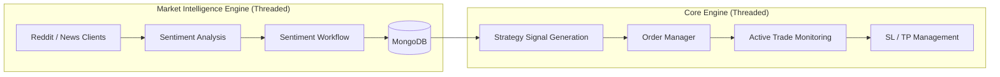

# **Orbit 🪐**  

## 🚀 Overview

Orbit is an AI-based trading framework designed to bridge research experimentation and production trading. The system focuses on combining classical strategies, machine learning models, and reinforcement learning experiments into a modular and automation-friendly architecture.

The project emphasizes:

Market Intelligence

Strategy Research experimentation → Production

Automated Trade execution and monitoring 

## System Architecture

### High-Level Runtime Flow

## 🛠️ Getting Started
Prerequisites

Python 3.10+

Linux environment recommended

Redis / MongoDB (optional depending on configuration)

Installation
git clone https://github.com/ipankaj/Orbit.git
cd Orbit
poetry install

Running the Project
poetry run orbit

## 🤝 Contributing

Contributions are welcome. Orbit is a research-driven system, and improvements that enhance:

Stability

Observability

Performance

Research capabilities

Documentation

are highly encouraged.

Please open an issue or submit a pull request with a clear description of changes.

## 🙏 Acknowledgements & Copyright

Orbit is currently in its early development phase. The project is evolving through ongoing research, experimentation, and iteration. Appreciation goes to everyone who shares ideas, feedback, and technical insights that help shape the direction of the system.

This project reflects a continuous learning process and aims to grow into a stable and research-driven trading framework over time.

Copyright © 2026 Pankaj Kumar. All rights reserved
