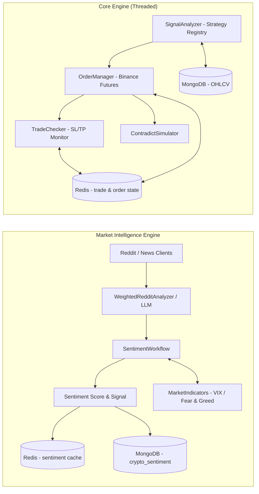

# Orbit 🪐

## Overview

Orbit is an AI-based trading framework that bridges research experimentation and production trading. It integrates classical strategies, machine learning models, and reinforcement learning experiments into a modular, automation-friendly architecture for both market intelligence and trading operations.

### Key Features
- **Market Intelligence:** Run hourly, web-grounded financial and crypto-futures sentiment analysis with validated sources.
- **Automated Trading:** Execute and monitor Binance Futures trades with precision, including SL/TP lifecycle management.
- **Modular Design:** Easily integrate custom strategies via a lazy-loading strategy registry.
- **Self-contained Strategies:** Production BTC, ETH, and BCH strategies are versioned and deployed with Orbit; no private runtime repository is required.
- **Research to Production:** Smooth transition from trading ideas to live trading with contradict simulation support.

## Setup and Installation

### Prerequisites
- Python 3.10+
- Linux environment (recommended)
- Redis and MongoDB (required for trade state and OHLCV data)

### Installation Steps
1. Clone the repository:
   ```
   git clone https://github.com/ipankaj/Orbit.git
   ```
2. Navigate into the project directory:
   ```
   cd Orbit
   ```
3. Install dependencies using Poetry:
   ```
   poetry install
   ```

## Usage

### Running the Project
Start the application with:
```
poetry run orbit
```
Assets omitted from the execution map are `paper`-only, which blocks exchange
order submission. The current rollout maps BTC, ETH, and BCH to Testnet with
`ORBIT_ASSET_EXECUTION_MODES=BTCUSDT:testnet,ETHUSDT:testnet,BCHUSDT:testnet`.
Live approval must still name exactly the live symbols. See
[`docs/operations/SAFE_ADAPTIVE_TRADING.md`](docs/operations/SAFE_ADAPTIVE_TRADING.md)
for accounting, risk policy, EC2 rollout, and strategy-promotion procedures.
The strategy migration and ownership boundary are documented in
[`docs/architecture/STRATEGY_CONSOLIDATION.md`](docs/architecture/STRATEGY_CONSOLIDATION.md).
The OpenAI model choice, provider fallback order, and market-intelligence
configuration are documented in
[`docs/architecture/MARKET_INTELLIGENCE_LLM.md`](docs/architecture/MARKET_INTELLIGENCE_LLM.md).
This command launches `BinanceAutomation`, the top-level trading automation controller found in `src/orbit/core/main.py`. It orchestrates three long-running daemon threads:

1. **Signal Analysis** — aligns to 15-minute candle boundaries, generates and processes trading signals via `SignalAnalyzer`, and sleeps for 900 seconds (15 minutes) between cycles.
2. **Trade Checker** — monitors active Binance Futures positions and manages SL/TP lifecycle via `TradeChecker`.
3. **Sentiment Cron** — runs hourly sentiment analysis via `Croner` and `SentimentWorkflow`.

A fourth daemon thread, **MonitorThread**, periodically checks all worker threads every 300 seconds and sends Discord alerts if any have stopped.

Configuration is loaded from `config/config.json` via `config/config.py`. Key configuration fields include:

- `trading_pairs` — symbols analysed for signals: `BTCUSDT`, `ETHUSDT`, `BCHUSDT`.
- `trade_checker_pair` — symbols monitored for open positions: `BCHUSDT`, `BTCUSDT`, `BNBUSDT`, `ETHUSDT`, `MKRUSDT`, `LTCUSDT`, `SOLUSDT`, `ATOMUSDT`, `XRPUSDT`.
- `risk_management` — per-symbol risk fractions (`BTCUSDT`: 0.01, `ETHUSDT`: 0.03, `BCHUSDT`: 0.03) and a shared `stop_loss_percent` of 1.
- `FUTURE_LEVERAGE` — default futures leverage of `2` (overridden to `5` for `BTCUSDT` in code).
- `FIXED_TRADE_AMOUNT` — fixed notional per symbol (`BTCUSDT`: $600, `ETHUSDT`: $30, `BCHUSDT`: $30).
- `cooldown_hours` — per-symbol cooldown after a trade (e.g. `SOLUSDT`: 8 h, `ETHUSDT`: 1 h, others: 2 h).
- `trading_pairs_precision` — quantity precision (decimal places) per symbol used when placing orders.

## Contributing

We welcome contributions that improve:

- **Stability**
- **Observability**
- **Performance**
- **Innovation in Research Methods**
- **Documentation**

**How to Contribute:**
- Create a new branch for your feature or bug fix.
- Make your changes and ensure tests pass.
- Submit a pull request with a clear description of your changes.

For any questions or to discuss ideas, please create an issue.

## System Architecture

### High-Level Runtime Flow



## Acknowledgements

Orbit is in its early development phase and evolves with ongoing research, experimentation, and iteration. We appreciate everyone's ideas, feedback, and technical insights that help shape the system.

© 2026 Pankaj Kumar. All rights reserved.
