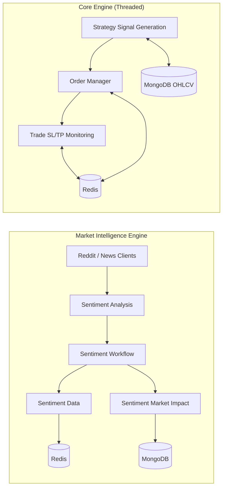

# Orbit 🪐

## Overview

Orbit is an AI-based trading framework that bridges research experimentation and production trading. It integrates classical strategies, machine learning models, and reinforcement learning experiments into a modular, automation-friendly architecture for both market intelligence and trading operations.

### Key Features
- **Market Intelligence:** Harness social media and news data for insights.
- **Automated Trading:** Execute and monitor trades with precision.
- **Modular Design:** Easily integrate custom strategies and tools.
- **Research to Production:** Smooth transition from trading ideas to live trading.

## Setup and Installation

### Prerequisites
- Python 3.10+
- Linux environment (recommended)
- Redis and MongoDB (optional based on configuration)

### Installation Steps
1. Clone the repository:
   ```
   git clone https://github.com/ipankaj/Orbit.git
   ```
2. Navigate into the project directory:
   ```
   cd Orbit
   ```
3. Install dependencies using Poetry:
   ```
   poetry install
   ```

## Usage

### Running the Project
Start the application with:
```
poetry run orbit
```
This command launches the main trading automation controller. Refer to the source code for customization and further configurations.

## Contributing

We welcome contributions that improve:

- **Stability**
- **Observability**
- **Performance**
- **Innovation in Research Methods**
- **Documentation**

**How to Contribute:**
- Create a new branch for your feature or bug fix.
- Make your changes and ensure tests pass.
- Submit a pull request with a clear description of your changes.

For any questions or to discuss ideas, please create an issue.

## System Architecture

### High-Level Runtime Flow



## Acknowledgements

Orbit is in its early development phase and evolves with ongoing research, experimentation, and iteration. We appreciate everyone's ideas, feedback, and technical insights that help shape the system.

© 2026 Pankaj Kumar. All rights reserved.
