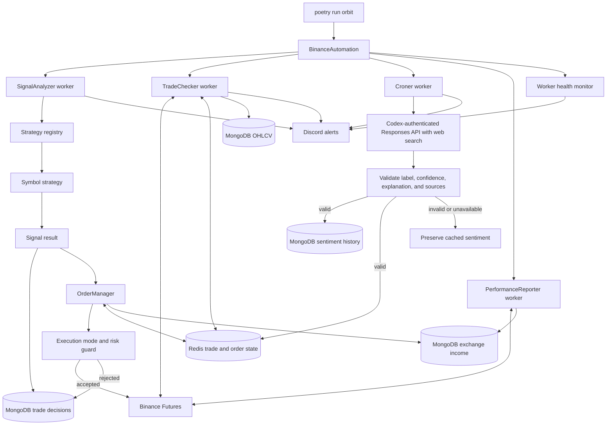

# Core runtime flow

This diagram is the authoritative high-level view of the running application.

Market intelligence only updates the sentiment filter. An exchange order still
requires a strategy signal, an enabled per-asset execution mode, and acceptance
by the risk guard.
