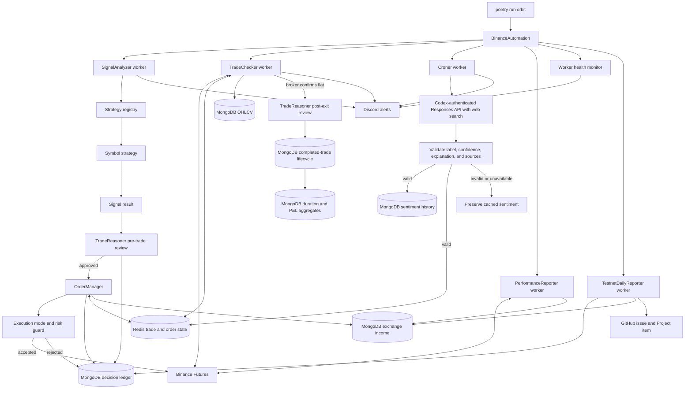

# Core runtime flow

This diagram is the authoritative high-level view of the running application.

Market intelligence only updates the sentiment filter. An exchange order still
requires a strategy signal, a successful pre-trade LLM approval, an enabled
per-asset execution mode, and acceptance by the risk guard. The LLM never places
orders: entry reasoning gates the handoff to `OrderManager`, while exit reasoning
runs only after Binance confirms the position is flat. Entry, execution, and exit
events remain linked by the decision identifier so daily Testnet reports can
publish auditable lifecycle evidence to the configured GitHub Project.
