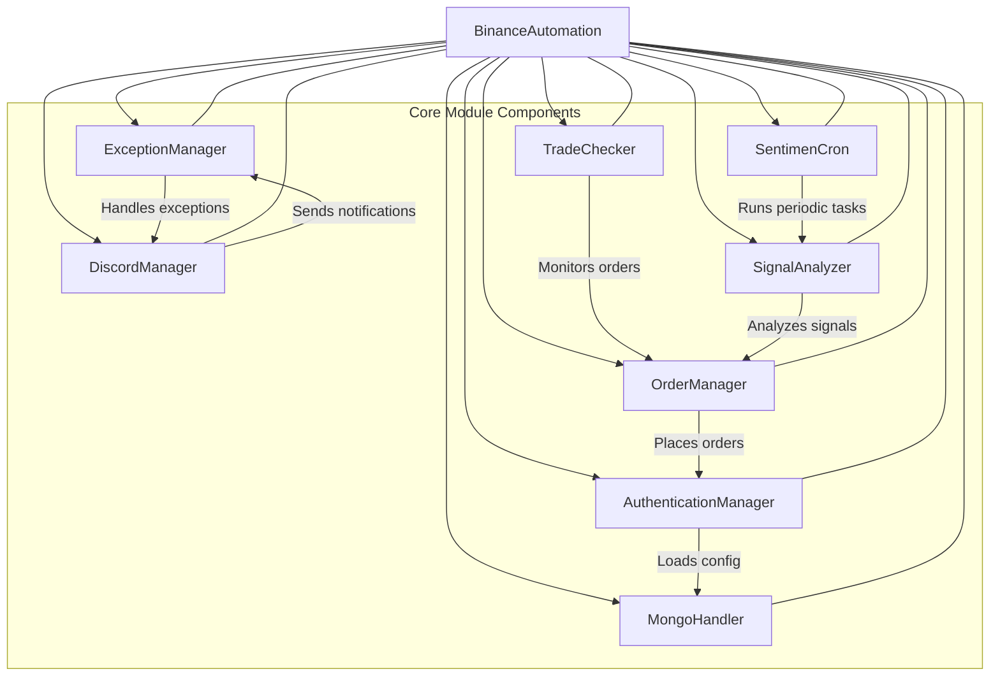

# Core Module Flowchart

Below is a flowchart that illustrates the architecture and execution flow of the core module.

This diagram shows the major components of the core module and their interactions.
