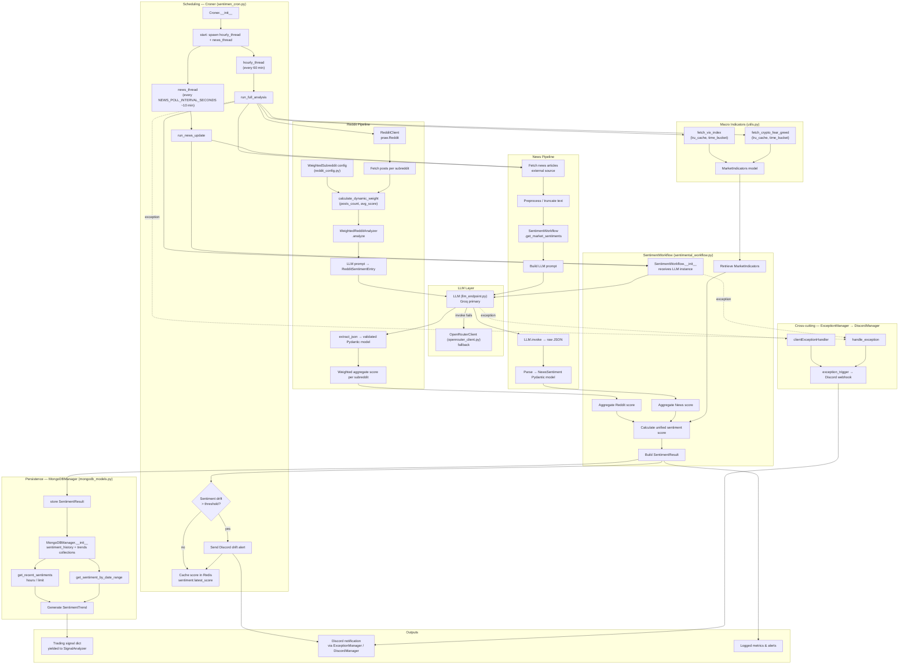

# Market Sentiment Module Flow

## Summary

The Market Intelligence module performs end-to-end crypto sentiment analysis by combining Reddit community sentiment, LLM-classified news sentiment, and macro market indicators (VIX, Fear & Greed Index) into a unified sentiment score. It is orchestrated by `SentimentWorkflow`, scheduled by `Croner`, and backed by two LLM providers (Groq primary, OpenRouter fallback). Results are persisted to MongoDB and surfaced as trading signals consumed by `SignalAnalyzer`.

Key characteristics:
- **Dual LLM strategy**: `LLM` (Groq) is the primary inference engine; `OpenRouterClient` is the automatic fallback.
- **Weighted Reddit analysis**: Each subreddit carries a configurable static weight plus a dynamic weight derived from post count and average score.
- **Sentiment drift detection**: `Croner` compares the latest sentiment score against a cached Redis value and fires a Discord alert when the drift exceeds `SENTIMENT_DRIFT_THRESHOLD`.
- **Two scheduling cadences**: full analysis runs hourly; news + Reddit updates run every `NEWS_POLL_INTERVAL_SECONDS` (≈10 min).
- **Exception handling**: every class inherits `ExceptionManager` → `DiscordManager`, so all unhandled errors are reported to Discord automatically.

---

## Diagram

