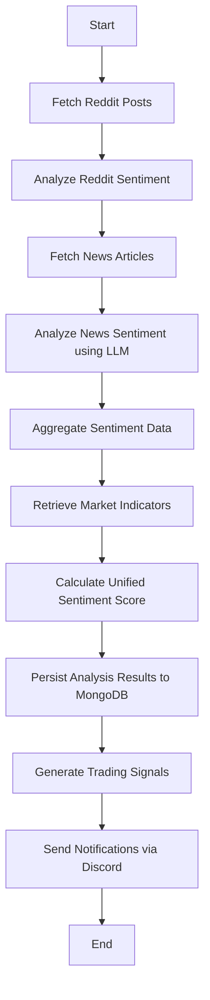

# Market Sentiment Module Flow Chart

```mermaid
flowchart TD
    A[Start] --> B[Fetch Reddit Posts]
    B --> C[Analyze Reddit Sentiment]
    C --> D[Fetch News Articles]
    D --> E[Analyze News Sentiment using LLM]
    E --> F[Aggregate Sentiment Data]
    F --> G[Retrieve Market Indicators]
    G --> H[Calculate Unified Sentiment Score]
    H --> I[Persist Analysis Results to MongoDB]
    I --> J[Generate Trading Signals]
    J --> K[Send Notifications via Discord]
    K --> L[End]
```
