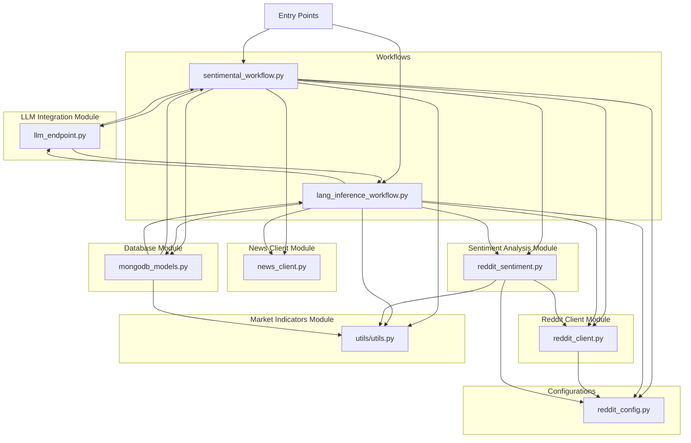

# Project Architecture Overview

## High-Level Architecture Diagram

## Module Responsibilities

- **reddit_client.py:** Handles fetching posts from Reddit's weighted subreddits including dynamic weight calculations.
- **news_client.py:** Fetches and extracts sentiment from recent news articles relevant to market topics.
- **reddit_sentiment.py:** Analyzes and aggregates individual Reddit post sentiment with weighted influence and category aggregation.
- **utils/utils.py:** Provides market indicator retrievals such as VIX and Fear & Greed indices, and sentiment parsing utilities.
- **llm_endpoint.py:** Interfaces with large language models to generate sentiment classifications and reasoning.
- **mongodb_models.py:** Defines MongoDB models and persistence layer for sentiment records, trend analysis, and trading signals.
- **reddit_config.py:** Contains subreddit categories and logic to calculate dynamic weights based on engagement/activity.
- **sentimental_workflow.py:** Implements an end-to-end market sentiment analysis workflow combining Reddit sentiment, news sentiment, and market indicators with LLM reasoning and database persistence.
- **lang_inference_workflow.py:** Executes a parallelized, memory-aware workflow to fetch, analyze, summarize, and combine market sentiment data using LLMs and LangGraph constructs.

## Data Flow

1. **Data Acquisition:**
   - Reddit posts fetched from multiple weighted subreddits (`reddit_client.py`).
   - News articles retrieved related to financial topics (`news_client.py`).
   - Market indicators like VIX and Fear & Greed index pulled from utilities (`utils/utils.py`).

2. **Sentiment Analysis:**
   - Reddit post sentiments analyzed and weighted per category (`reddit_sentiment.py`).
   - News sentiment classified with LLM assistance (`llm_endpoint.py`).
   - Historical sentiment trends retrieved or calculated (`mongodb_models.py`).

3. **Combination and Reasoning:**
   - Multiple signals combined into unified sentiment scores and labels (`sentimental_workflow.py` and `lang_inference_workflow.py`).
   - LLM generates human-readable reasoning explaining final sentiment conclusions.

4. **Persistence and Analytics:**
   - Final results saved to MongoDB with indexed models (`mongodb_models.py`).
   - Trends and trading signals computed from persisted historical data.

## Entry Points

- `SentimentWorkflow` class in **sentimental_workflow.py**:
  - `fetch_reddit`, `fetch_news`, `fetch_indicators`, `get_market_sentiments`, `get_reasoning`, `_combine_results`, and `_save_to_database` methods facilitate the complete market sentiment analysis lifecycle.
